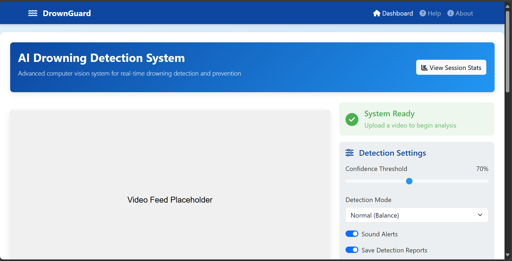
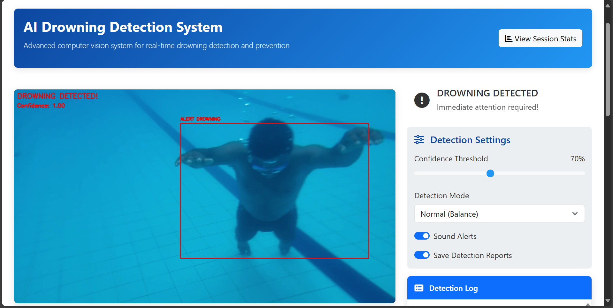
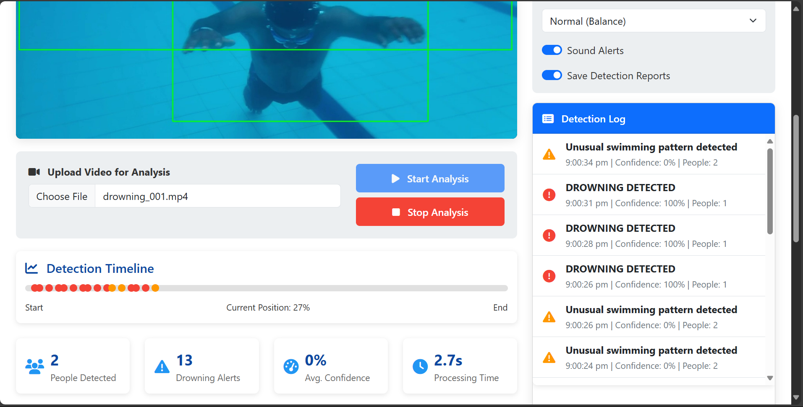
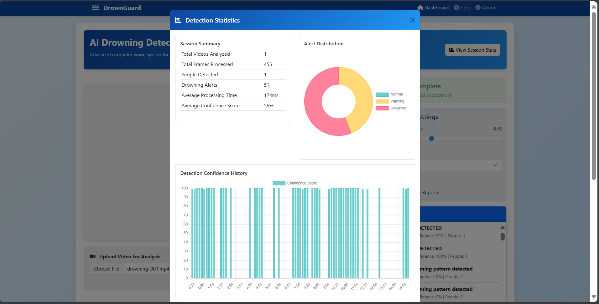
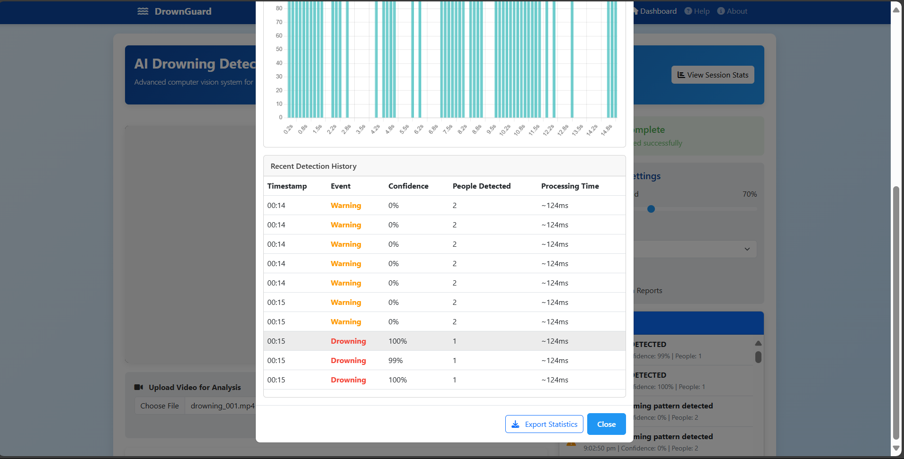

# 🌊 DrownGuard: ML-Powered Drowning Detection & Alert System

DrownGuard is an intelligent drowning detection solution that leverages machine learning and computer vision to identify potential drowning incidents in real time and trigger alerts. Designed for use in pools, water parks, and surveillance systems, it offers both web and command-line interfaces.

---

## 🚀 Features

- ⚡ Real-time drowning detection via video streams
- 🎥 Supports both pre-recorded videos and webcam input
- 🌐 Web interface for live monitoring
- 🔔 Visual and audio alerts on potential drowning events
- 📊 Modular architecture with custom ML and CV pipelines

- 📈 Generates detailed statistical reports based on each session:
  - Detection confidence scores
  - Number of people detected per frame
  - Frame processing time and FPS

---

## 🖼️ Screenshots

### 1. Web Interface - Upload Page


### 2. Real-Time Detection


### 3. Drowning Alert Display


### 4. Statistics Report


#### 4.1 detection confidence scores



---

## 🛠️ Technologies Used

- **Python**
- **OpenCV**
- **PyTorch**
- **Flask**
- **YOLOv3(You Only Look Once)** – for object detection
- **HTML, CSS, JS** – for responsive web UI

---

## 📦 Installation Guide

### 1. Clone the repository
```bash
git clone https://github.com/YOUR_USERNAME/DrownGuard.git
cd DrownGuard
```

### 2. Set up the virtual environment
```bash
python -m venv venv
venv\Scripts\activate  # On Windows
# OR
source venv/bin/activate  # On macOS/Linux
```

### 3. Install required packages
```bash
pip install -r requirements.txt
```

> 📝 **Note:** Make sure you have Python 3.8+ and pip installed.

### 4. Download Model Files
- The application will automatically download required YOLO weights and configs on the first run.
- If not, you can manually download them from the [official YOLO website](https://pjreddie.com/darknet/yolo/).

---

## 🚦 Usage Instructions

### 🔹 Web Interface
1. Launch the Flask web server:
   ```bash
   python app.py
   ```

2. Open your browser and visit:
   ```
   http://127.0.0.1:5000
   ```

3. Upload a video file or start the webcam to initiate real-time detection.

### 🔹 Command-Line Interface

#### Analyze a video file:
```bash
python DrownDetect.py --source your_video_file.mp4
```

#### Use webcam stream (default is 0):
```bash
python DrownDetect.py --source 0
```

---

## 🧠 How It Works

### Detection Workflow:

1. **Person Detection**  
   - Uses YOLOv3 or YOLOv5 to detect individuals in each frame.

2. **Behavior Classification**  
   - For a **single person**: A custom-trained CNN model classifies swimming behavior as *normal* or *drowning*.
   - For **multiple people**: A proximity-based logic evaluates potential drowning based on movement patterns and distances.

### Alerts:
- **Red bounding boxes** for drowning detection.
- **Audio alarms** triggered via the web interface.

---

## 📁 Project Structure

```
DrownGuard/
│
├── app.py              # Flask web app
├── DrownDetect.py      # CLI detection tool
├── requirements.txt    # Python dependencies
├── model.pth           # PyTorch CNN model
├── lb.pkl              # Label binarizer
│
├── templates/          # HTML templates
├── static/             # CSS, JS, assets
├── screenshots/        # Images for documentation
└── cvlib/              # Custom vision utilities
```

---

## 🔐 Best Practices

- Never upload large files or environment folders (like `env/`) to GitHub.
- Use `.gitignore` to avoid tracking virtual environments and binaries:
  ```plaintext
  env/
  *.dll
  *.pyd
  *.lib
  *.exe
  ```

---


## 🙏 Acknowledgments

- **YOLO** – For robust object detection
- **PyTorch** – For training and deploying the CNN model
- OpenCV, Flask, HTML, CSS, JS – For building the full-stack system

---

> 🔍 Have questions or need help? Open an [issue on GitHub](https://github.com/YOUR_USERNAME/DrownGuard/issues).
